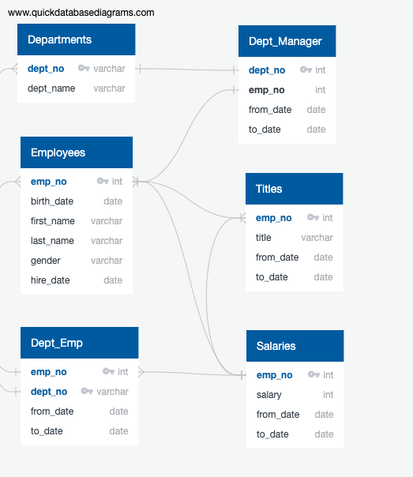
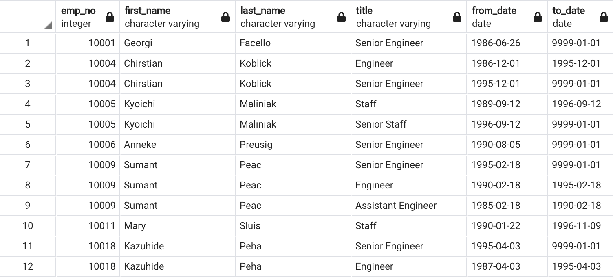
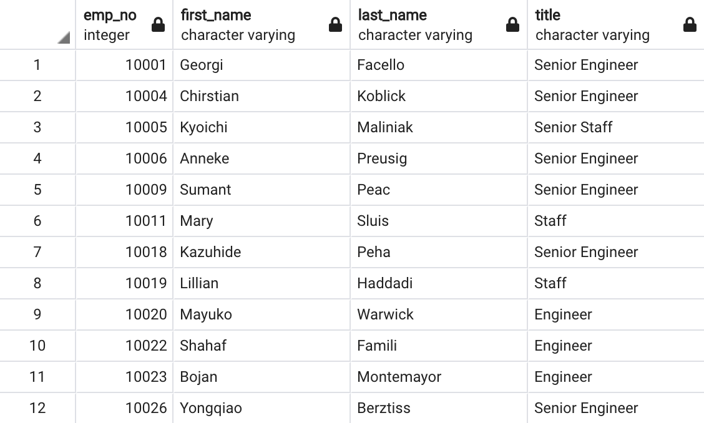
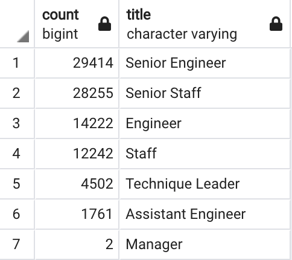
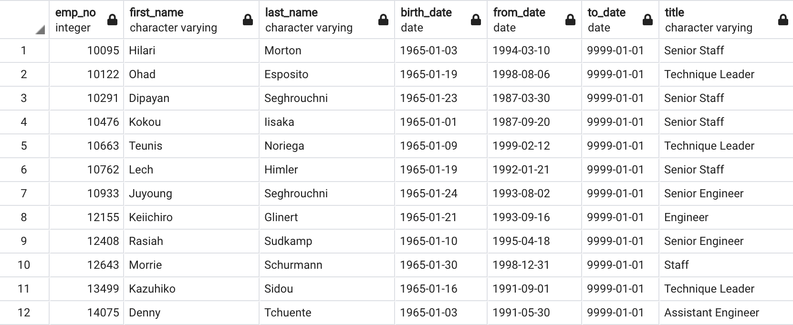
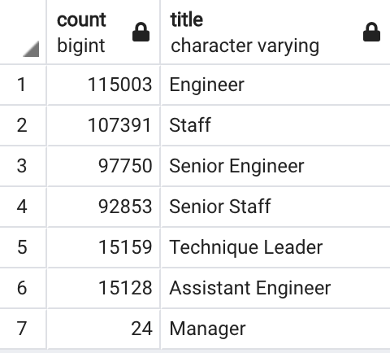
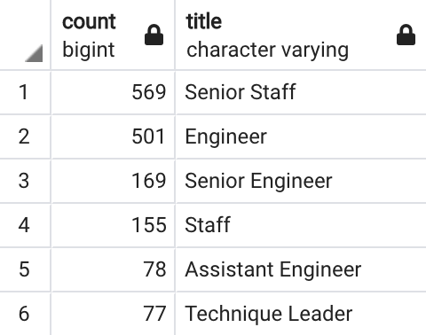

# Pewlett_Hackard_Analysis
Employee Database Analysis Project for UT Austin Data Analysis Bootcamp 

# Project Overview
The manager of the Pewlett-Hackard Corporation has requested we analyze their employee database to determine the number of soon-to-be-retiring employees by title and to identify employees who are eligible to participate in a mentorship program based on age. 

# Resources
- Data Sources: departments.csv, dept_emp.csv, dept_manager.csv, employees.csv, titles.csv, salaries.csv
- Software: PostgreSQL, pgAdmin 4, Visual Studio Code

# Results
The following schema demonstrates the relationships between the databases we were provided: 

 

- In order to find the number of employees who would be retiring soon by title, we joined columns from the employees and titles tables into a new table, which we labeled retirement_titles. We filtered this for employees born between 1952-1955 using the following code: 

SELECT employees.emp_no, employees.first_name, employees.last_name, titles.title, titles.from_date, titles.to_date  
INTO retirement_titles 
FROM employees  
LEFT OUTER JOIN titles 
ON employees.emp_no = titles.emp_no 
WHERE (employees.birth_date BETWEEN '1952-01-01' AND '1955-12-31') 
ORDER BY emp_no ASC; 

This gave us a table in which some employees who have held multiple titles appear more than once: 

 

- To rectify the problem of having employees appearing multiple times we used the following DISTINCT ON command to remove the duplicates and created another table which we labeled unique_titles: 

SELECT DISTINCT ON (emp_no) emp_no, 
first_name, 
last_name, 
title 
INTO unique_titles 
FROM retirement_titles 
ORDER BY emp_no, to_date DESC; 

This produced a table without duplicates: 

 

- We then used the COUNT function to find the total number of soon-to-retire employees by title: 

SELECT COUNT(title), title 
INTO retiring_titles 
FROM unique_titles 
GROUP BY title 
ORDER BY count DESC; 

 

- In order to determine the number of employees eligible for the mentorship program we joined the employees, titles, and dept_employees tables, then filtered for employees who were born in 1965 and who were still currently employed (signified by the company under the arbitrary to_date of '9999-01-01'). Finally, we eliminated duplicate records by using the DISTINCT ON command: 

SELECT DISTINCT ON (employees.emp_no) employees.emp_no, employees.first_name, employees.last_name, employees.birth_date,  
    dept_employee.from_date, dept_employee.to_date,  
    titles.title 
INTO mentorship_eligibility 
FROM employees 
LEFT OUTER JOIN dept_employee 
ON employees.emp_no = dept_employee.emp_no 
LEFT OUTER JOIN titles 
ON employees.emp_no = titles.emp_no 
WHERE (employees.birth_date BETWEEN '1965-01-01' AND '1965-12-31') AND (dept_employee.to_date = '9999-01-01') 
ORDER BY emp_no ASC; 

This produced a table of employees eligible for the program: 

 

# Summary
- How many roles will need to be filled as the "silver tsunami" begins to make an impact? 
As we can see in the retiring_titles table, the following numbers of positions will need to be filled: 

 

We can anticipate that we will need to fill the roles of 29,414 Senior Engineers, 28,255 Senior Staff, 14,222 Engineers, 12,242 Staff, 4502 Technique Leaders, 1761 Assistant Engineers, and 2 Managers. To better understand what this means for the company we can compare the numbers of employees retiring to the numbers of the total workforce. We can find the numbers of titles of all current employees regardless of age using the following code: 

SELECT COUNT(title), title 
INTO total_titles 
FROM employees  
LEFT OUTER JOIN titles 
ON employees.emp_no = titles.emp_no 
GROUP BY title 
ORDER BY count DESC; 

 

From this we can see that the number of employees retiring is a significant portion of the total employee population for each job title. 

- Are there enough qualified, retirement-ready employees in the departments to mentor the next generation of Pewlett Hackard employees?
In order to answer this question, we first need to determine the counts of mentorship-eligible employees by title. We can do this using the code: 

SELECT COUNT(title), title 
INTO mentorship_titles 
FROM mentorship_eligibility 
GROUP BY title 
ORDER BY count DESC; 

 

Compared to the number of employees who will be retiring soon, the number of employees eligible for the mentorship program is small, in the hundreds rather than the thousands. There are certainly enough employees of the older generation to mentor the next generation of leaders.  

